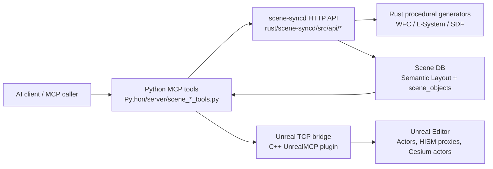

# Procedural Generation, Cesium, and Async Job Tools

> Issue #29 reference for the tools added by commit `20734b8` and the
> surrounding Rust -> Python -> Unreal pipeline.

## Tool quick reference

### Cesium geospatial tools

| Tool | Description |
|---|---|
| `cesium_check_plugin` | Reports whether `CesiumForUnreal` is installed/enabled and whether `CesiumRuntime` / `CesiumEditor` modules are loaded. |
| `cesium_setup_georeference` | Spawns or reuses `ACesiumGeoreference` and sets the level origin longitude, latitude, and height. |
| `cesium_add_tileset` | Spawns an `ACesium3DTileset` from either Cesium ion (`ion_asset_id` + token) or a direct 3D Tiles URL. |
| `cesium_place_actor_at_geolocation` | Finds an MCP-managed actor, attaches `UCesiumGlobeAnchorComponent` if needed, and moves it to lon/lat/height. |

### WFC / semantic layout / Unreal preview tools

| Tool | Description |
|---|---|
| `scene_create_wfc_grid` | Generates a pure WFC grid through Rust / `scene-syncd` without writing Scene DB or Unreal state. |
| `scene_create_wfc_grid_unreal` | Generates a WFC grid through `scene-syncd` and immediately materializes the result in Unreal actors/proxies. |
| `scene_wfc_to_semantic_layout` | Converts WFC tiles into Scene DB actors tagged `wfc_generated`, `wfc_tile_id:<id>`, and `layout_kind:wfc_<id>`. |
| `scene_show_wfc_proxy` | Reads WFC-generated Scene DB actors and creates grouped Unreal HISM draft proxies per tile id. |

### Async procedural job tools

| Tool | Description |
|---|---|
| `scene_procedural_job_submit` | Starts a long-running WFC or L-System job in `scene-syncd` and returns a `job_id`. |
| `scene_procedural_job_status` | Fetches status, coarse progress, optional `progress_message`, partial result, and final result for one job. |
| `scene_procedural_job_result` | Polls for a completed result, optionally waiting with a caller-provided timeout. |
| `scene_procedural_job_cancel` | Requests cancellation for a queued or running procedural job. |
| `scene_procedural_job_list` | Lists recent queued/running/completed procedural jobs retained by `scene-syncd`. |

## Pipeline overview



1. **Generate**: Python calls `scene-syncd` procedural endpoints (for example
   WFC or L-System). Heavy work can be submitted through async job endpoints.
2. **Persist**: `scene_wfc_to_semantic_layout` converts generated tiles into
   semantic scene objects so the result can be listed, edited, approved, or
   compiled like hand-authored layout data.
3. **Preview in Unreal**: `scene_show_wfc_proxy` batches tile placements by
   `tile_id` and calls Unreal draft-proxy commands so dense grids appear as
   HISM proxies instead of thousands of individual actors.
4. **Finalize**: The normal `scene_compile_*` / `scene_realize_*` tools can
   take over once the generated layout is accepted.

## Minimal WFC -> Semantic Layout -> HISM proxy example

```python
tiles = [
    {"id": "grass", "weight": 1.0},
    {"id": "water", "weight": 0.5},
]
constraints = [
    {"left": "grass", "right": "grass", "direction": "east"},
    {"left": "water", "right": "water", "direction": "east"},
    {"left": "grass", "right": "grass", "direction": "south"},
    {"left": "water", "right": "water", "direction": "south"},
]

grid = scene_create_wfc_grid(width=3, height=3, tiles=tiles, constraints=constraints, seed=42)
layout = scene_wfc_to_semantic_layout(
    scene_id="main",
    width=3,
    height=3,
    tiles=tiles,
    constraints=constraints,
    seed=42,
    tile_asset_map={
        "grass": "/Engine/BasicShapes/Cube.Cube",
        "water": "/Engine/BasicShapes/Cylinder.Cylinder",
    },
    cell_size={"x": 200.0, "y": 200.0},
    origin={"x": 0.0, "y": 0.0, "z": 0.0},
    extra_tags=["example_wfc"],
)
proxy = scene_show_wfc_proxy(
    scene_id="main",
    tile_mesh_map={
        "grass": "/Engine/BasicShapes/Cube.Cube",
        "water": "/Engine/BasicShapes/Cylinder.Cylinder",
    },
    proxy_name_prefix="example_wfc_proxy",
    tag_filter=["example_wfc"],
)
```

## Minimal async job workflow

Use async jobs when a WFC grid or L-System derivation may exceed the synchronous
bridge timeout.

```python
submit = scene_procedural_job_submit(
    generator="lsystem",
    params={
        "axiom": "F",
        "rules": [["F", "F[+F]F[-F]F"]],
        "iterations": 6,
        "step_length": 80.0,
    },
    seed=123,
)
job_id = submit["job_id"]

while True:
    status = scene_procedural_job_status(job_id)
    print(status["status"], status.get("progress"), status.get("progress_message"))
    if status["status"] in {"completed", "failed", "cancelled"}:
        break

result = scene_procedural_job_result(job_id, wait_seconds=0)
```

The `progress` field is a normalized `0.0` to `1.0` value. The optional
`progress_message` field is generator-authored text such as `WFC: collapsed
13/64 cells` or `L-System: iteration 4/10`, so UI clients can show useful
intermediate state instead of a long stall.

## Cesium integration notes

The Cesium tools are intentionally safe in projects that do not have Cesium
installed:

- `UnrealMCP.Build.cs` probes common `CesiumForUnreal.uplugin` locations.
- When found, it defines `WITH_CESIUM=1` and adds `CesiumRuntime` as a private
  module dependency.
- When missing, it defines `WITH_CESIUM=0`; the Python tools still register,
  and C++ handlers return actionable `error` + `hint` envelopes instead of
  failing to build.

For a **hard Cesium dependency** in a downstream project, add a project or plugin
entry for `CesiumForUnreal`, install the Marketplace/release package, and rebuild
so `WITH_CESIUM` is set during UnrealMCP compilation. Keep ion access tokens out
of logs; `cesium_add_tileset` reports the asset id/source but never echoes token
values.

Relevant upstream docs:

- Epic UE 5.7 Visual Studio setup: https://dev.epicgames.com/documentation/unreal-engine/setting-up-visual-studio-development-environment-for-cplusplus-projects-in-unreal-engine?lang=en-US
- Cesium for Unreal: https://cesium.com/learn/unreal/
- Cesium for Unreal API/reference: https://cesium.com/learn/cesium-unreal/ref-doc/

## Verification

- E2E coverage for the WFC pipeline lives in
  `Python/tests/e2e/test_phase1_procedural_generation.py`.
- The async job progress path has Rust unit coverage in
  `rust/scene-syncd/src/procedural/jobs.rs`.
- Python wrapper serialization for procedural realization lives in
  `Python/tests/unit/test_procedural_realization_wrappers.py`.
