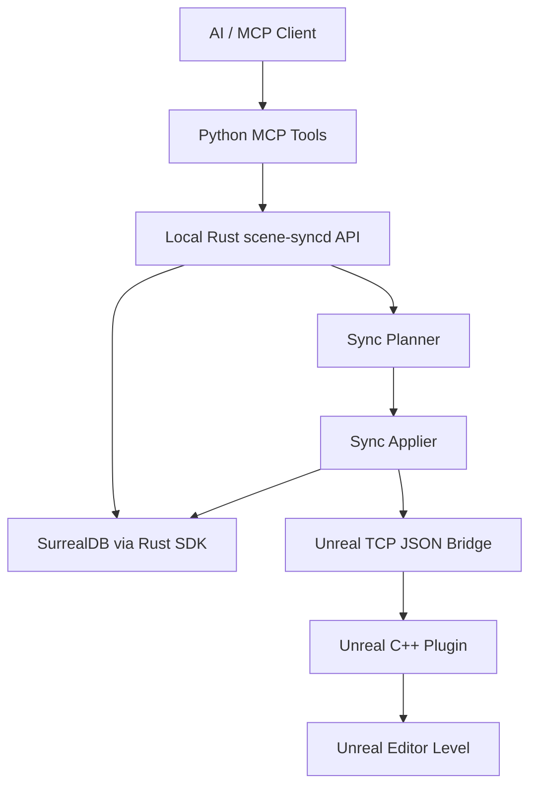
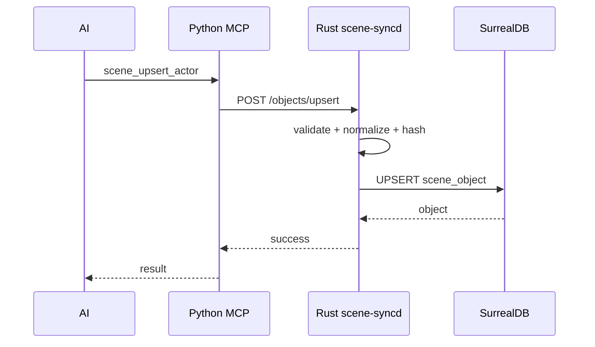
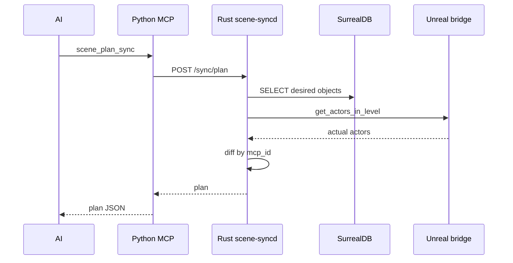
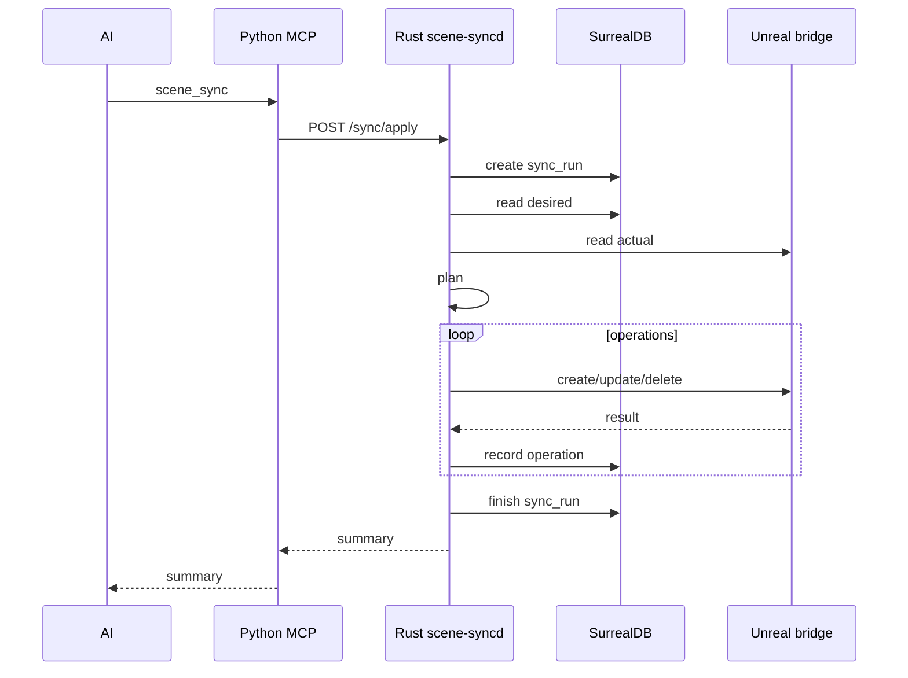

<!--
Project: Unreal MCP Scene Database / Sync System
DB: SurrealDB
Core: Rust SDK
Created: 2026-04-25
Scope: Design documents for a SurrealDB-backed desired-state sync architecture integrated with the existing Python MCP + Unreal C++ bridge codebase.
-->
# 02. System Architecture

## 1. Target architecture



## 2. Main idea

SurrealDB stores the desired world.

Unreal contains the actual world.

Rust compares both and applies the difference.

This architecture prevents the AI from needing to emit giant Python command blobs every time it wants to change a scene. Instead, the AI edits database state. Apparently “write down what you want before doing it” is revolutionary now.

## 3. Components

### 3.1 Python MCP server

Responsibilities:

- Register user-facing MCP tools.
- Call Rust `scene-syncd` over local HTTP.
- Return structured results to AI/client.
- Keep legacy immediate tools working.

Non-responsibilities:

- No SurrealQL.
- No sync diff logic.
- No direct DB ownership for scene state.

### 3.2 Rust `scene-syncd`

Responsibilities:

- Connect to SurrealDB through Rust SDK.
- Apply schema migrations.
- Validate scene objects.
- Compute desired hashes.
- Plan sync.
- Apply sync.
- Log sync runs and operations.
- Expose HTTP JSON API.

### 3.3 SurrealDB

Responsibilities:

- Store `scene`, `scene_group`, `scene_object`.
- Store snapshots.
- Store sync runs and operations.
- Later emit live query changes.

### 3.4 Unreal C++ bridge

Responsibilities:

- Spawn/update/delete actors.
- Attach and return `mcp_id` tags.
- Return actual actor state.
- Later support `apply_scene_delta`.

## 4. Process boundaries

| Boundary | Protocol | Reason |
|---|---|---|
| Python -> Rust | HTTP JSON | Simple and testable. |
| Rust -> SurrealDB | SurrealDB Rust SDK over WebSocket | Required core implementation. |
| Rust -> Unreal | Existing TCP JSON bridge | Reuse current plugin path. |
| C++ Plugin -> Unreal | Unreal Editor API | Existing engine integration. |

## 5. Deployment mode

Recommended MVP mode:

```text
SurrealDB server: ws://127.0.0.1:8000
Rust scene-syncd: http://127.0.0.1:8787
Python MCP server: existing server process
Unreal bridge: existing plugin port
```

Why server mode first:

- Easier to inspect with CLI/Surrealist.
- WebSocket aligns with live queries later.
- Rust service and DB can restart separately.
- Debugging embedded DB while also debugging Unreal is a special kind of punishment.

## 6. Data flow: upsert actor



Unreal is not touched.

## 7. Data flow: plan sync



## 8. Data flow: apply sync



## 9. Architecture rules

1. SurrealDB is source of truth for managed desired state.
2. Unreal actual state can drift.
3. Rust owns reconciliation.
4. Python exposes tools only.
5. `mcp_id` is mandatory for managed objects.
6. Sync is explicit and idempotent.
7. Deletes require tombstone and explicit apply.
8. Live query autosync is later and disabled by default.

## 10. Future evolution

### Stage A: Manual sync

AI edits DB, user calls plan/apply.

### Stage B: Semi-automatic sync

AI edits DB, Rust detects changes but only plans.

### Stage C: Live autosync

SurrealDB live query triggers sync after debounce.

### Stage D: Batch delta

Rust sends `apply_scene_delta` to C++ bridge for large updates.

### Stage E: Full scene intelligence

Groups, relations, dependency graphs, UI, conflict resolution, multi-agent editing.
